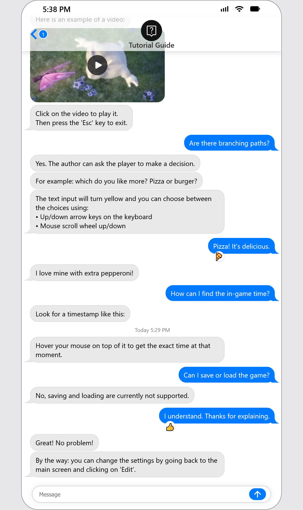
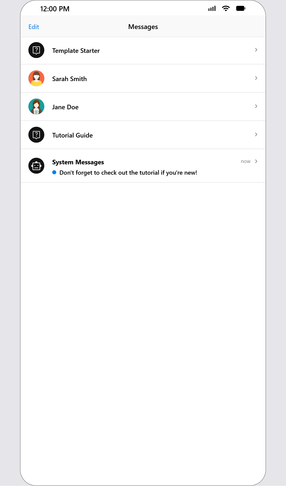
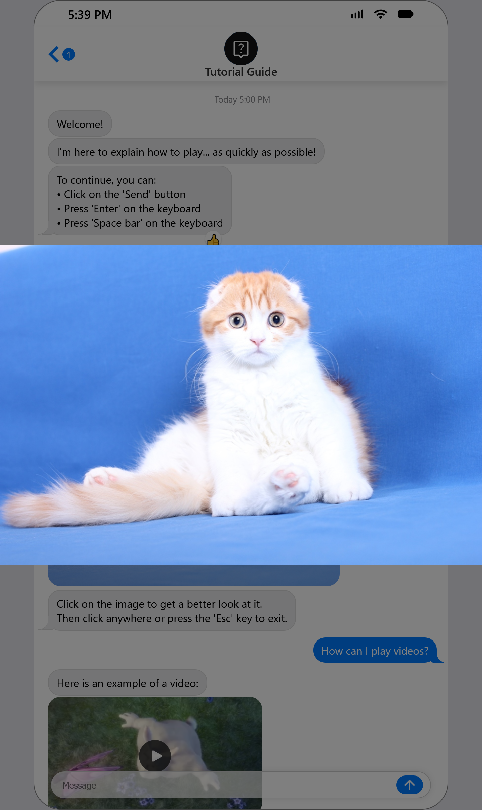
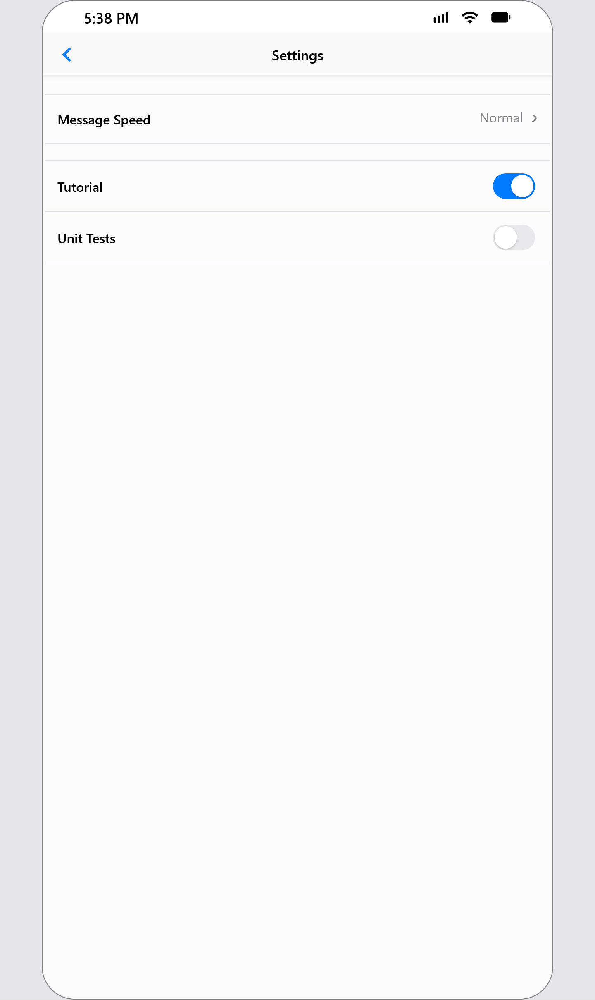

# Messaging App Simulator
Narrative game engine in the format of iOS Messages App.

   

## Working Demo
https://www.youtube.com/watch?v=GZf1cyoUoys

## Try It Out
https://hyssopi.github.io/Messaging-App-Simulator/

## For Authors
If you want to use the game engine to create a story.  
Read: [README_AUTHOR](https://github.com/Hyssopi/Messaging-App-Simulator/blob/main/README_AUTHOR.md)

## For Engine Developers
If you want to modify the game engine to have custom functionalities via coding.  
Read: [README_ENGINE_DEVELOPER](https://github.com/Hyssopi/Messaging-App-Simulator/blob/main/README_ENGINE_DEVELOPER.md)
