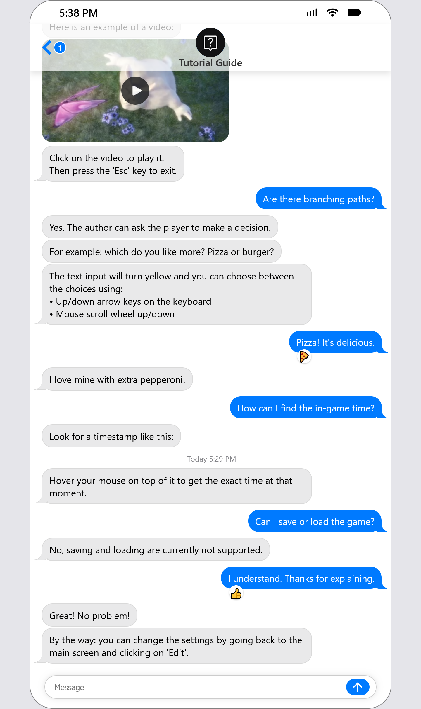
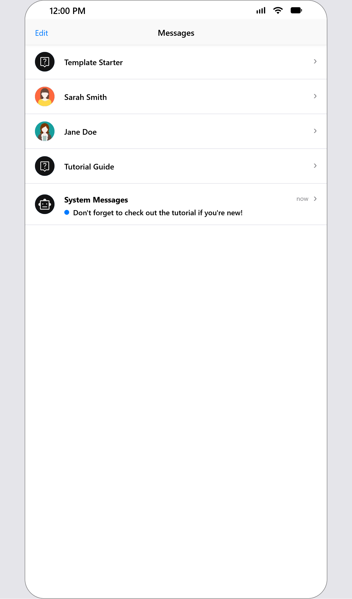
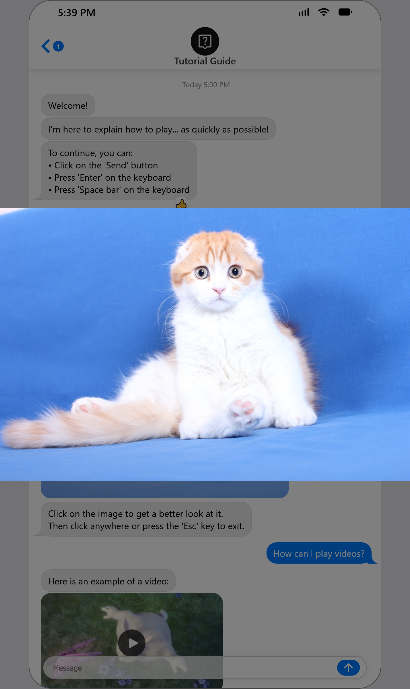
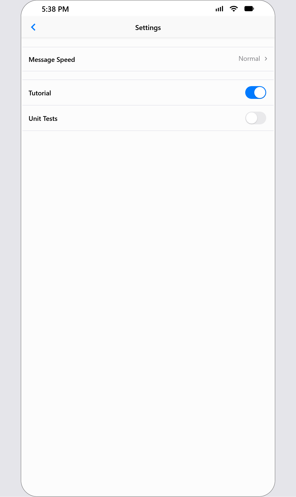

# Messaging App Simulator

Narrative game engine in the format of iOS Messages App.

   

## Working Demo

https://www.youtube.com/watch?v=GZf1cyoUoys

## Try It Out

https://hyssopi.github.io/Messaging-App-Simulator/

## For Authors

If you want to use the game engine to create a story.  
Read: [README_AUTHOR](https://github.com/Hyssopi/Messaging-App-Simulator/blob/main/README_AUTHOR.md)

## Prerequisites

`Node.js` required to build.

## Build

Run in command prompt:

```bash
scripts\fullBuild.bat
```

## Run

Open `index.html` in a web browser (Firefox, Chrome, etc).

## Test

Enable `Unit Tests` in the settings, then go to `Jane Doe` contact to start the tests.  
Side by side demo:  
https://www.youtube.com/watch?v=4tdykQAxJmc
