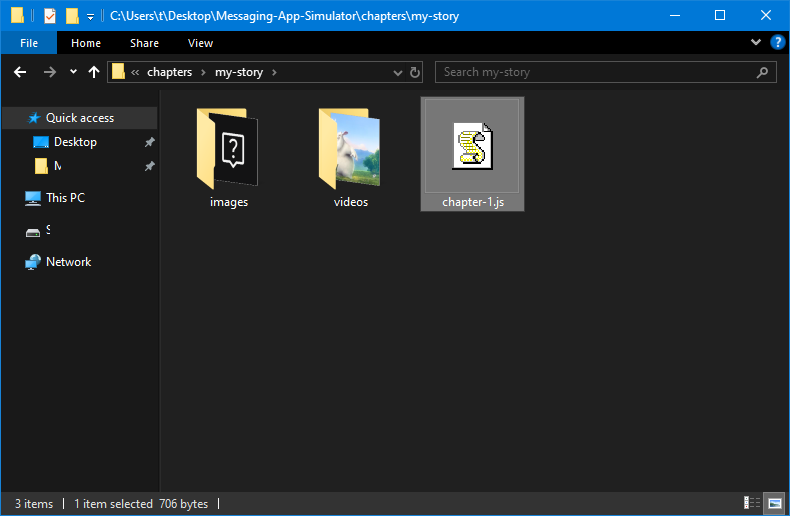

# Messaging App Simulator for Authors
Create a story in the format of iOS Messages App using this tool.
- Easy to use
- Plenty of usage examples
- Almost no coding experience needed
- Runs on any web browser without any set up (static HTML, meaning it is simple to host)

## Run
Open `index.html` in a web browser (Firefox, Chrome, etc).

## Add New Chapter
1. Make a copy of the template folder: `chapters/template` and name the new copy. For example: `chapters/my-story`.
1. Also rename the chapter file: `chapters/my-story/template.js`. For example: `chapters/my-story/my-story.js` or `chapters/my-story/chapter-1.js`


1. Add the chapter into `index.html`:
```html
<script src="chapters/my-story/chapter-1.js"></script>
```
4. Open `index.html` in a web browser or refresh the page

## Usage Examples
There are comprehensive examples in the tutorial and unit tests:
```bash
chapters/tutorial/tutorial.js
chapters/debug/unit-tests.js
```

## Advice/Tips
- Put all your images and videos in the chapters folder. For example:
```bash
chapters/my-story/images
chapters/my-story/videos
```
- Recommended to use `Visual Studio Code` to write up your chapters
- Just follow the `tutorial` and `unit-tests`, it should cover everything you possibly may want to do
- Some functions need `await`, don't forget it. Reference off the `unit-tests` if you're unsure.
- Look at `api.ts` for the full supported API documentation
